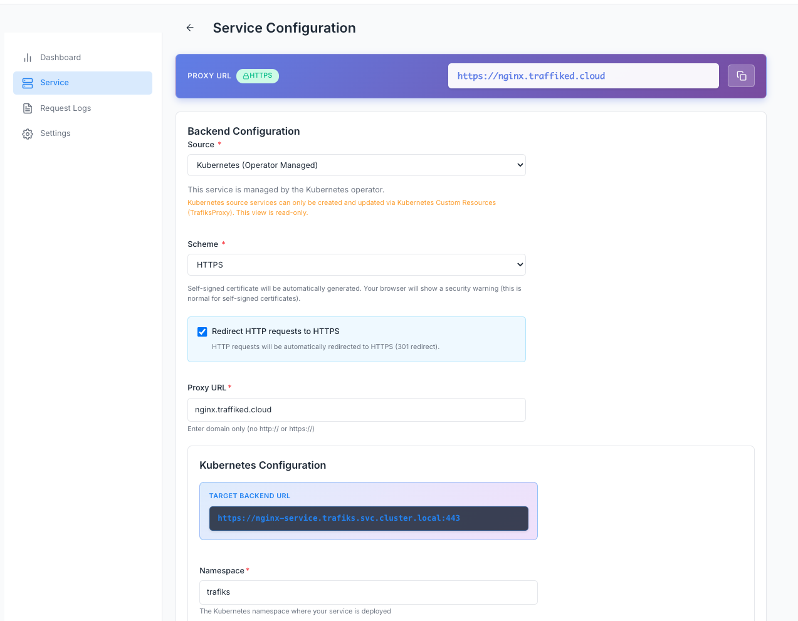

# Trafiks

Trafiks is a modern API Gateway and Proxy Service built with Go and React. It provides intelligent request routing, caching, monitoring, and management capabilities for your microservices and APIs.



## Features

- **Multi-Source Service Discovery**: Support for database-backed/external domain services, Docker containers, and Kubernetes services
- **HTTPS/TLS Support**: Automatic certificate management with SNI (Server Name Indication) support
- **Request Caching**: Configurable caching with TTL support for improved performance
- **Request Logging & Replay**: Comprehensive request logging with replay capabilities
- **Real-time Metrics**: Live metrics streaming via Server-Sent Events (SSE)
- **Webhooks**: Account-level webhooks for event notifications
- **API Key Management**: Secure API key authentication
- **Modern Dashboard**: Built-in React dashboard for service management
- **Docker Compose Support**: Easy local development setup
- **Kubernetes Ready**: Helm chart and operator for production deployments

## Architecture

Trafiks follows a microservices architecture with two main components that work together to provide a complete API gateway solution:

### Backend

The **Backend** is the core API server that handles:

- **Proxy Requests**: Routes incoming HTTP/HTTPS requests to configured backend services with support for:
  - Request/response caching with configurable TTL
  - Header and query parameter manipulation
  - TLS termination and HTTPS redirects
  - Request logging and metrics collection
- **Service Management**: RESTful API for managing services, projects, API keys, and webhooks
- **Service Discovery**: Multi-source service discovery supporting:
  - Database-backed services (Trafiks source)
  - Docker containers via Docker API
  - Kubernetes services via Ingress and Service resources
- **Real-time Metrics**: Server-Sent Events (SSE) streaming for live metrics visualization
- **Dashboard**: Embedded React dashboard for service management and monitoring

### Agent

The **Agent** is an optional background worker that processes asynchronous tasks:

- **Webhook Delivery Processing**: Consumes webhook delivery jobs from Redis Streams and delivers them to configured webhook endpoints
- **Retry Logic**: Handles failed webhook deliveries with automatic retry mechanisms
- **Worker Pool**: Multiple concurrent workers for parallel webhook processing
- **Consumer Groups**: Uses Redis Streams consumer groups to ensure reliable message delivery and prevent duplicate processing

### Data Flow

1. **Proxy Request Flow**:
   - Client request → Backend → Service lookup → Cache check → Backend service → Response → Cache (if applicable) → Client

2. **Webhook Delivery Flow**:
   - Event occurs in Backend → Webhook delivery created in PostgreSQL → Delivery pushed to Redis Stream (`webhook:deliveries`)
   - Agent workers consume from Redis Stream using consumer groups → HTTP POST to webhook URL → Status updated in database

### Infrastructure Components

- **PostgreSQL**: Stores services, projects, API keys, webhooks, and request logs
- **Redis**: 
  - **Caching**: Response caching for GET requests with TTL support
  - **Streams**: Queue for webhook deliveries using Redis Streams with consumer groups for reliable processing
- **Redis Streams**: Used for webhook delivery queue with:
  - Ordered message processing
  - Consumer groups for load distribution across multiple agent instances
  - Automatic acknowledgment (ACK) after successful processing
  - Pending message tracking for retry scenarios

> **Note**: The agent is optional and only required if you have configured webhooks. If no webhooks are configured, you can run Trafiks with just the backend component. The backend can scale independently, and you can run multiple agent instances for high-throughput webhook processing.

## Installation

Trafiks can be installed in three ways: as a binary, using Docker, or on Kubernetes with Helm and the operator.

### Option 1: Binary Installation

#### Prerequisites

- Go 1.19 or higher
- Node.js 18+ (for building the UI)
- PostgreSQL 12+ and Redis 6+ (for running the application)

#### Building from Source

1. **Clone the repository:**
   ```bash
   git clone git@github.com:olamilekan000/trafiks.git
   cd trafiks
   ```

2. **Build the backend:**
   ```bash
   cd trafiks
   # Build UI and embed into Go binary
   make build
   
   # Or build separately
   make build-ui        # Build React UI
   go build -o trafiks ./cmd/server/main.go
   ```

3. **Build the agent (optional, only if using webhooks):**
   ```bash
   go build -o trafiks-agent ./cmd/agent/main.go
   ```

4. **Configure and run:**
   ```bash
   # Copy example config
   cp trafiks/config.example.json $HOME/.config/trafiks/config.json
   # Edit config.json with your database and Redis settings
   
   # Run the backend
   ./trafiks -config $HOME/.config/trafiks/config.json
   
   # Run the agent (if webhooks are configured)
   ./trafiks-agent -config $HOME/.config/trafiks/config.json
   ```

### Option 2: Docker Installation

#### Using Docker Compose (Recommended for Local Development)

**Option A: Using the main Trafiks docker-compose:**
```bash
cd trafiks
make start
```

**Option B: Using the complete example with Docker source discovery:**
```bash
cd examples/docker
docker-compose up -d
```

This example includes Trafiks backend, agent, PostgreSQL, Redis, and a sample service that is automatically discovered via Docker labels. See `examples/docker/README.md` for details.

#### Using Docker Directly

1. **Build images:**
   ```bash
   # Build backend image
   docker build -f trafiks/Dockerfile.backend -t trafiks-backend:latest trafiks/
   
   # Build agent image (optional, only if using webhooks)
   docker build -f trafiks/Dockerfile.agent -t trafiks-agent:latest trafiks/
   ```

2. **Run the backend:**
   ```bash
   docker run -d \
     -v $HOME/.config/trafiks:/config \
     -p 8889:8889 \
     -p 8443:8443 \
     trafiks-backend:latest
   ```

3. **Run the agent (if webhooks are configured):**
   ```bash
   docker run -d \
     -v $HOME/.config/trafiks:/config \
     trafiks-agent:latest
   ```

### Option 3: Kubernetes Installation

#### Prerequisites

- Kubernetes cluster (1.19+)
- Helm 3.x
- kubectl configured to access your cluster

#### Install Trafiks Backend with Helm

1. **Navigate to the Helm chart directory:**
   ```bash
   cd trafiks-charts
   ```

2. **Create a values file or use the default:**
   ```bash
   # Copy and customize values
   cp values.yaml my-values.yaml
   # Edit my-values.yaml with your configuration
   ```

3. **Install Trafiks:**
   ```bash
   helm install trafiks . -f my-values.yaml
   ```

4. **Get the API key from the dashboard:**
   - Access the Trafiks dashboard (configure ingress or port-forward)
   - Login with default credentials: `admin@trafiks.local` / `admin123`
   - Navigate to API Keys section and create a new API key
   - Save the API key - you'll need it for the operator configuration

5. **Enable the agent (optional, only if webhooks are configured):**
   ```yaml
   # In values.yaml or my-values.yaml
   agent:
     enabled: true
   ```

#### Install Trafiks Operator

The Trafiks operator manages TrafiksProxy and TrafiksBackend custom resources, and provides a custom Ingress controller for TLS termination and traffic routing.

**Prerequisites:**
- Trafiks backend API must be installed and running (see Helm installation above)
- API key from the Trafiks dashboard (required for operator to communicate with backend)

1. **Install the operator:**
   ```bash
   cd trafiks-operator
   make deploy IMG=olamilekan001/trafiks-operator:v0.0.4
   ```

2. **Create a Secret with backend credentials:**
   ```bash
   # Edit examples/operator/trafiksbackend.yaml and update the Secret:
   # - baseURL: URL of your Trafiks backend API
   # - apiKey: API key from the dashboard
   
   kubectl apply -f examples/operator/trafiksbackend.yaml
   ```
   
   Example Secret and TrafiksBackend resource:
   ```yaml
    apiVersion: v1
    kind: Secret
    metadata:
      name: trafiks-backend-credentials
      namespace: trafiks
    type: Opaque
    stringData:
      baseURL: "http://trafikscloud.cloud"
      apiKey: "tfk_c42b5bf52cb3c2d07b051739f99ddb9cad88dc9a1f207ac5616ac53ae8797c08"

    ---
    apiVersion: proxy.trafiks.io/v1
    kind: TrafiksBackend
    metadata:
      name: trafiks-backend-config
      namespace: trafiks
    spec:
      secretRef:
        name: trafiks-backend-credentials
        namespace: trafiks
   ```

3. **Create TrafiksProxy resources for your services:**
   ```bash
   kubectl apply -f examples/operator/application.yaml
   ```

4. **Use the Trafiks Ingress controller:**
   ```yaml
   apiVersion: networking.k8s.io/v1
   kind: Ingress
   metadata:
     name: my-ingress
   spec:
     ingressClassName: trafiks
     rules:
       - host: example.com
         http:
           paths:
             - path: /
               pathType: Prefix
               backend:
                 service:
                   name: my-service
                   port:
                     number: 80
     tls:
       - hosts:
           - example.com
         secretName: example-tls
   ```

## Quick Start

### Local Development

1. **Start dependencies:**
   ```bash
   cd trafiks
   make startdb
   ```

2. **Run the application:**
   ```bash
   # Development mode with hot reload
   make dev
   ```

3. **Access the dashboard:**
   - Open `http://localhost:8889/dashboard`
   - Login with default credentials: `admin@trafiks.local` / `admin123`

## Configuration

Configuration is stored in `$HOME/.config/trafiks/config.json`. See `trafiks/config.example.json` for all available options.

### Key Configuration Options

```json
{
  "server_port": "8889",
  "tls_port": "8443",
  "app_base_url": "http://localhost:8889",
  "environment": "local",
  "database": {
    "host": "localhost",
    "port": 5432,
    "user": "admin",
    "password": "password",
    "name": "trafiks",
    "ssl_mode": "disable"
  },
  "redis": {
    "host": "localhost:6379"
  },
  "dashboard": {
    "enabled": true
  }
}
```

## Service Sources

Trafiks supports multiple service discovery mechanisms:

### 1. Trafiks Source

Default source where services are stored in the database. Users manually configure services through the dashboard or API with:
- Proxy URL (domain)
- Target Backend URL
- Configuration (cache, headers, query params, TLS)

**Configuration**: No additional config needed - this is the default source.

### 2. Docker Source

Discovers services automatically from Docker containers using labels. Trafiks monitors the Docker socket and discovers containers with specific labels.

**Configuration** (`config.json`):
```json
{
  "docker": {
    "socket_path": "unix:///var/run/docker.sock"
  }
}
```

**Docker Labels** (add to your containers):
```yaml
labels:
  trafiks.service: "my-service"      # Service identifier
  trafiks.environment: "production"  # Environment name (optional)
```

**Example**: See `examples/docker/` for a complete Docker Compose setup.

### 3. Kubernetes Source

Discovers services from Kubernetes Ingress and Service resources using annotations. Works with the Trafiks operator to automatically sync services.

**Ingress Annotations**:
```yaml
annotations:
  trafiks.io/proxy-url: "example.com"
  trafiks.io/project-name: "my-project"
  trafiks.io/scheme: "https"
```

**TrafiksProxy CRD**:
```yaml
apiVersion: proxy.trafiks.io/v1
kind: TrafiksProxy
metadata:
  name: my-proxy
spec:
  proxyURL: "example.com"
  projectName: "my-project"
  scheme: "https"
  kubernetes:
    namespace: "default"
    serviceName: "my-service"
    servicePortName: "http"
```

**Example**: See `examples/operator/` for Kubernetes deployment examples.

## Testing

### Backend Tests

The Trafiks backend includes comprehensive unit tests for services, repositories, and routes. To run the tests:

```bash
cd trafiks
make test
```

This runs all tests with coverage. The tests use standard Go testing with `gomock` for mocking dependencies. Tests cover:
- Service layer logic (API keys, projects, proxy requests, webhooks)
- Repository layer interactions
- Route handlers
- Cache and source manager functionality

### Operator Tests

The Trafiks operator includes comprehensive unit tests for controllers. To run the tests:

1. **Setup test environment** (one-time setup):
   ```bash
   cd trafiks-operator
   make setup-envtest
   ```
   This downloads the required Kubernetes test binaries (kubebuilder, etcd, kube-apiserver).

2. **Run unit tests:**
   ```bash
   make test-unit
   ```

The tests use `envtest` which provides an in-memory Kubernetes API server - no real cluster is required. Tests cover:
- TrafiksProxy reconciliation
- TrafiksBackend reconciliation
- Ingress controller functionality
- TLS certificate management


## License

This project is licensed under the MIT License.
